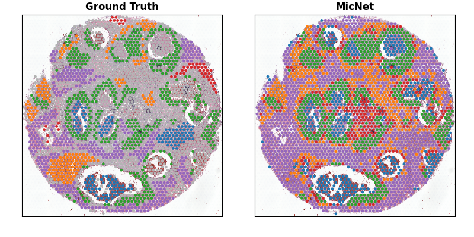

# MicNet
MicNet: Integrating spatially resolved transcriptomes and pathology images by contrastive deep neural network

# Introduction
Exploring the spatial organization of cells alongside their gene expression is key to understanding how tissues acquire distinct structures and functions. Recent advances in spatial transcriptomics (SRT) technologies have enabled the joint profiling of tissue morphology and mRNA expression, yet integrating these two modalities remains a major challenge. To address this, we developed MicNet, an unsupervised deep learning framework that bridges histology images and transcriptomic data, providing robust, scalable, and biologically meaningful representations for spatial domain identification and downstream analyses.

<div align="center">
  
</div>

## Dependencies

This project is GPU-based. Please use the GPU server with CUDA library.

The packages in conda environment:

- python >=3.6
- torch
- torchvision
- torchaudio
- spicy
- matplotlib
- numpy
- scikit-image
- scikit-learn
- tifffile
- pandas
- imagecodecs
- seaborn

Option: need to install Jupyter Notebook if running .ipynb code

## Install Conda Environment

Install Conda [https://docs.conda.io/projects/conda/en/latest/user-guide/install/index.html](https://docs.conda.io/projects/conda/en/latest/user-guide/install/index.html)

You can skip the installation of conda if already installed

MicNet works with Python >=3.6. Here we use python=3.6.10

```
conda create -n "MicNet" python=3.6.10
conda activate MicNet
pip install -r requirement.txt
```
[Optional] It is to run .ipynb code

```
conda install -c conda-forge notebook
```

## User Guideline

- The three input files: pathology image, count, and spot meta data files

- - Quick start using the default settings

<pre>
python main.py
</pre>

- Parameters: 

| Parameter | Description | Default Value |
| --------- | ----------- | ------------ |
| image_file | image file location | ./example_data/Visium_FFPE_Human_Breast_Cancer_image.tif |
| count_file | count file location | ./example_data/Counts.txt|
| transformation_file| spot meta data location | ./example_data/Spot_metadata.csv |
| trained_breast_model_save_path | the path to save the intermediate trained models | ./output/trained_models |
| epoch_trained | the number of the trained | 50 |
| is_save_trained | whether or not to save the trained models. 1 or 0 | 0 (not saved) |
| final_result | the output result folder of feature extraction | ./final_result |
| device | Only GPU card supported | cuda:0 |

## Input File

- Pathology Image Files. The supported files include svs, png, tif, jpg, etc. (Example: "example_data/Visium_FFPE_Human_Breast_Cancer_image.tif")
- Count File (add more instruction here to create a count file) (Example: "example_data/Counts.csv")
- Spot Meta Data File (add more instruction here to create a count file) (Example: "example_data/Spot_metadata.csv"

## Output File

- The trained model (intermediate): triggered by is_save_trained
- The final model: save as output_model_path

## Validation (optional)

- Four input files: pathology image, spot meta data, feature extraction and annotation files.

eta data with annotation file: the benchmark annotation for validation (Example: example_data/meta_data_with_annotation.csv)

- Quick start using the default settings

<pre>
python validate.py
</pre>

- Parameters: 

| Parameter | Description | Default Value |
| --------- | ----------- | ------------ |
| image_file | image file location | ./example_data/Visium_FFPE_Human_Breast_Cancer_image.tif |
| transformation_file| spot meta data location | ./example_data/Spot_metadata.csv |
| meta_data_annotation | meta data with annotation file location | ./example_data/meta_data_with_annotation.csv |
| final_result | the final result of feature extraction | ./output/features.pt|

## Output

- MicNet: ARI=0.5381, AMI=0.4611
- A png figure 'validation.png' as below




# Manually run the code
- [ ] [Spatial transcriptomic data pre-processing](https://github.com/QinZhou-work/MicNet/blob/464a7f6974ca83b80a688c73a8075c21bc498664/tutorial/MicNet_1_data_check_and_preprocessing.ipynb)

- [ ] [Training MicNet](https://github.com/QinZhou-work/MicNet/blob/f3324491b3dc150e10969607dfc755ef122239b9/tutorial/MicNet_2_train_MicNet.ipynb)

- [ ] [Inference MicNet](https://github.com/QinZhou-work/MicNet/blob/f3324491b3dc150e10969607dfc755ef122239b9/tutorial/MicNet_3_Inference.ipynb)
      
- [ ] [Clustering the domains](https://github.com/QinZhou-work/MicNet/blob/93805f9c47b349e579ff31d8f86b6a987fe8bfb8/tutorial/MicNet_4_clustering_with_MicNet.ipynb)

### License
Following UT Southwestern Office for Technology Development, the project is using the license from The University of Texas Southwestern Medical Center.
